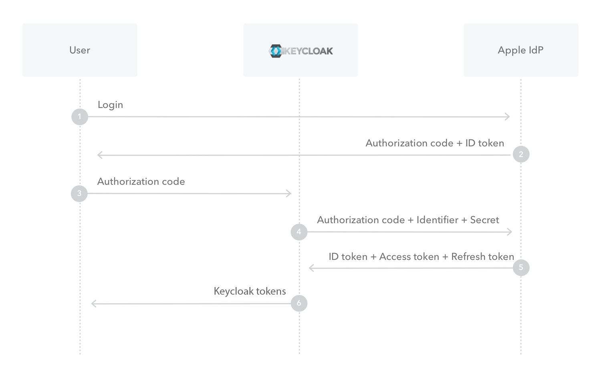

# Apple Identity Provider for Keycloak :apple:

This repository represents an extension for [Keycloak](https://www.keycloak.org), which
enables [Sign in with Apple](https://developer.apple.com/documentation/sign_in_with_apple) for web-based applications and native
application (via `token-exchange`).

### Apple vs. the rest of the world

Since Apple does not comply 100% to the existing `OpenID Connect` standard, some customizations are necessary in order to make the _Apple
way_
compatible to Keycloak. Differences are as follows:

- If scopes were requested, Apple sends the `TokenResponse` as a `POST` request
- There's no `userinfo` endpoint. `email`, `firstName` and `lastName` are transmitted only the first time the user signs in with Apple.
- The `/token`-request must contain a client-secret (JWT) which is signed using a specific private key (`.p8` file).

## Installation

1. Make sure you have a copy of the latest [JAR](https://github.com/klausbetz/apple-identity-provider-keycloak/releases/latest) of this
   provider package or include it as a Maven dependency .
2. Deploy the JAR file to keycloak (by placing it in `/opt/keycloak/providers` inside your docker container; alternatively see
   this [guide](https://www.keycloak.org/docs/latest/server_development/index.html#registering-provider-implementations))
3. Keycloak might need a restart (or a fresh container when using docker)

See a [`Dockerfile` example](docs/README_docker_installation.md).

## Compatibility

Since this package implements internal Keycloak SPIs, there's a chance this extension breaks with a new major version of Keycloak.  
See compatibility list below to find the version that suits your Keycloak version.

| Keycloak Version   | Extension Version                 |
|--------------------|-----------------------------------|
| `< 17.0.0`         | Not tested. Use at your own risk. |
| `17.0.0 <= 19.0.3` | `1.2.0`                           |
| `20.0.0 <= 20.0.5` | `1.3.0 <= 1.4.1`                  |
| `21.0.0 <= 21.0.2` | `1.5.0`                           |
| `21.1.0 <= 21.1.2` | `1.6.0`                           |
| `>= 22.0.0`        | `>= 1.7.0`                        |

:information_source: In Keycloak `v21.X.Y` this extension cannot be used effectively, since the additional properties such
as `Team ID`, `Key ID`
and so on are not displayed in the Admin UI.   
However, you can still use this extension with Keycloak `v21.X.Y` when you use some sort of external configuration tools like terraform or
[keycloak-config-cli](https://github.com/adorsys/keycloak-config-cli) where you do not rely on Keycloak's UI.

:information_source: For Keycloak `v19` and `v20` you have to switch to the old Admin UI to use this extension (see this
paper [Keycloak 19.0.0 release](https://www.keycloak.org/2022/07/keycloak-1900-released.html#_new_admin_console_is_now_the_default_console))

## Configuration

Log into your Keycloak admin console and add `Apple` as new `Identity Provider` and get comfortable with the configuration options:

| Option                   | Description                                                                     |
|--------------------------|---------------------------------------------------------------------------------|
| Client ID (= Service ID) | Your Service ID from your Apple Developer Account.        |
| Client Secret            | (Ignored) Just use a dummy value.                                               |
| Team ID                  | Your Team ID obtained from your Apple Developer Account.                        |
| Key ID                   | A key identifier obtained from your Apple Developer Account.                    |
| p8 Key                   | Raw content of p8 key file you get from your Apple Developer Account.           |
| Default Scopes           | Scopes to request from Apple (for web-based logins). Defaults to `name%20email` |

:raising_hand: If you are unsure where you get these values from your Apple Developer Account you may want to check out this [guide](https://developer.okta.com/blog/2019/06/04/what-the-heck-is-sign-in-with-apple#how-sign-in-with-apple-works-hint-it-uses-oauth-and-oidc).

:warning: Make sure to add the keycloak broker-URL (`https://<keycloak-url>/realms/<realm>/broker/apple/endpoint`) to your valid redirect
URLs in your Apple Developer Account.

## Token exchange

Token exchange can be used to trade Apple tokens for Keycloak access- and refresh-tokens.  
This flow is mostly interesting for native applications like iOS apps, to provide native login options.

### 1. Using Apple ID-Token (recommended)

You want to use the `/token` endpoint of your realm to exchange an Apple ID-Token for Keycloak tokens.  
`<keycloak server url>/realms/<realm>/protocol/openid-connect/token`  
`application/x-www-form-urlencoded`

| Parameter            | Description                                                                                                                                                                                                       |
|----------------------|-------------------------------------------------------------------------------------------------------------------------------------------------------------------------------------------------------------------|
| `client_id`          | the client id of your Keycloak client                                                                                                                                                                             |
| `grant_type`         | `urn:ietf:params:oauth:grant-type:token-exchange`                                                                                                                                                                 |
| `subject_token`      | ID-Token from Apple                                                                                                                                                                                               |
| `subject_issuer`     | `apple` (the name of the social provider in keycloak)                                                                                                                                                             |
| `subject_token_type` | `urn:ietf:params:oauth:token-type:id_token`                                                                                                                                                                       |
| `user_profile`       | `{ "name": { "firstName": string, "lastName": string }, "email": string }` optional. The JSON string that Apple sends on the first login (only required for the first login if you want to store the user's name) |

### 2. Using Apple `authorization_code`

#### Details

Looking at `3` from the image above, you want to use the `/token` endpoint of your realm to exchange an Apple `authorizationCode` for
Keycloak tokens.  
`<keycloak server url>/realms/<realm>/protocol/openid-connect/token`  
`application/x-www-form-urlencoded`

| Parameter        | Description                                                                                                                                                                                                                                                    |
|------------------|----------------------------------------------------------------------------------------------------------------------------------------------------------------------------------------------------------------------------------------------------------------|
| `client_id`      | the client id of your Keycloak client                                                                                                                                                                                                                          |
| `grant_type`     | `urn:ietf:params:oauth:grant-type:token-exchange`                                                                                                                                                                                                              |
| `subject_token`  | `authorizationCode` from Apple                                                                                                                                                                                                                                 |
| `subject_issuer` | `apple` (the name of the social provider in keycloak)                                                                                                                                                                                                          |
| `user_profile`   | `{ "name": { "firstName": string, "lastName": string }, "email": string }` optional. The JSON string that Apple sends on the first login (only required for the first login  if you want to store the user's name)                                             |
| `app_identifier` | In case the configured Service ID doesn't match the bundle-identifier of the native iOS app, this parameter can be used, so that Service ID is ignored and `app_identifier` is used instead (Apple might throw a client_id mismatch exception if not provided). If the Service ID already matches your bundle-identifier you can omit this parameter. |

